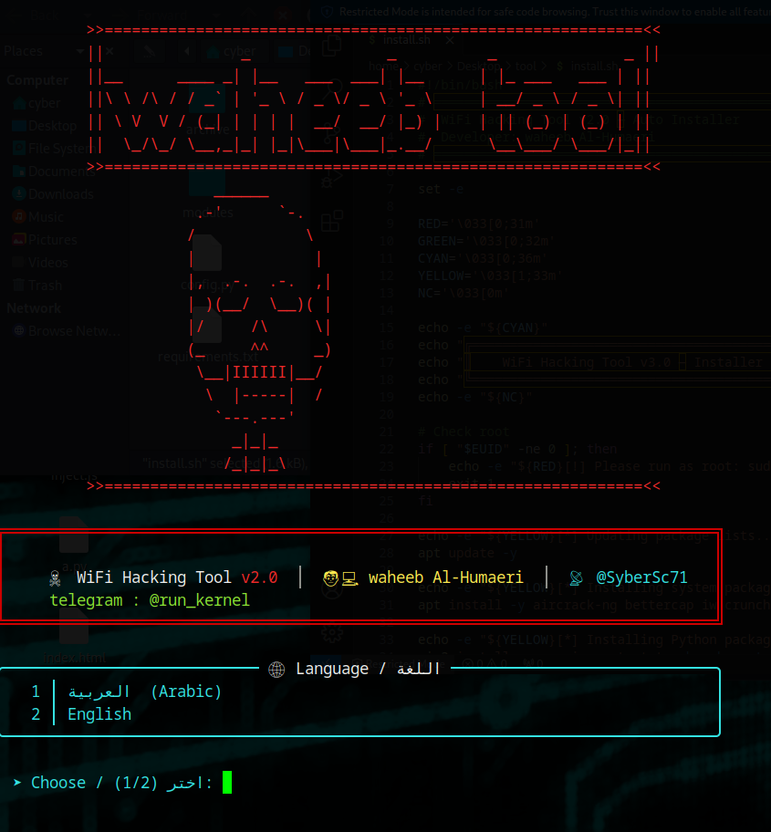
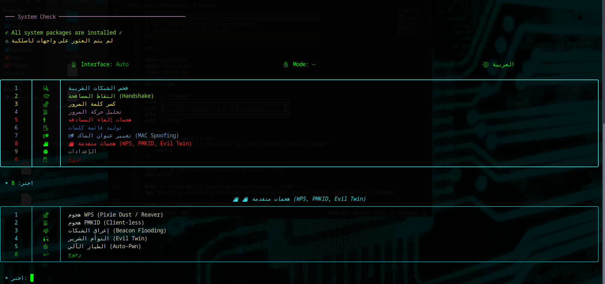
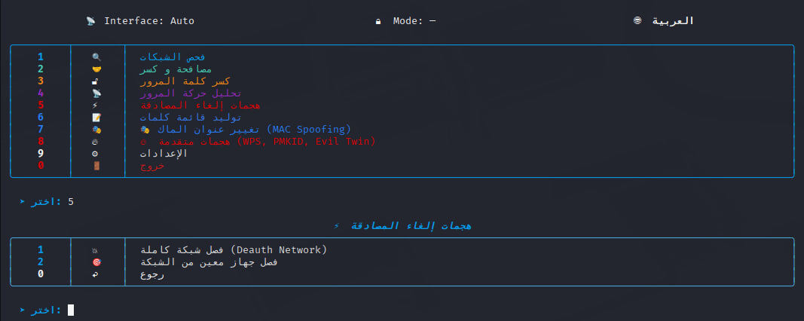
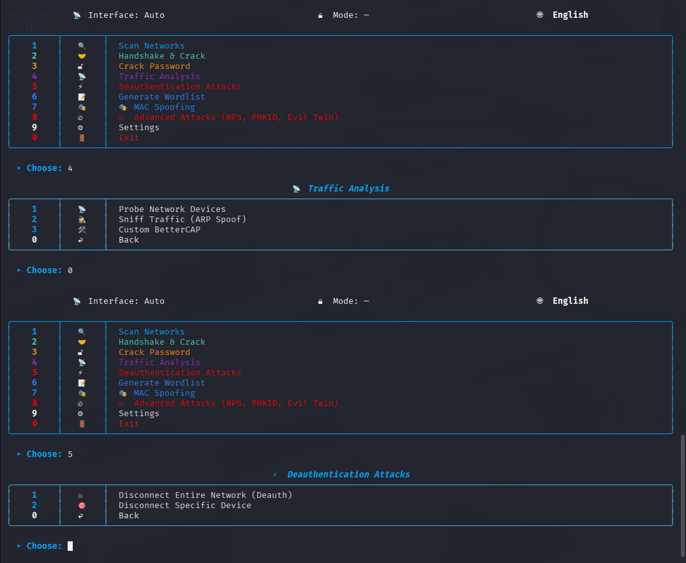
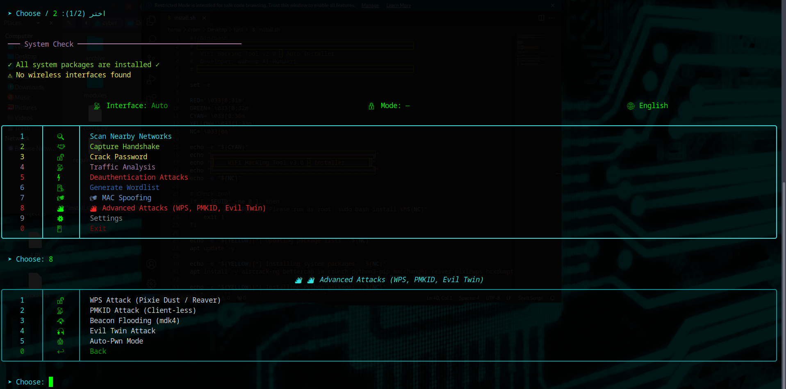
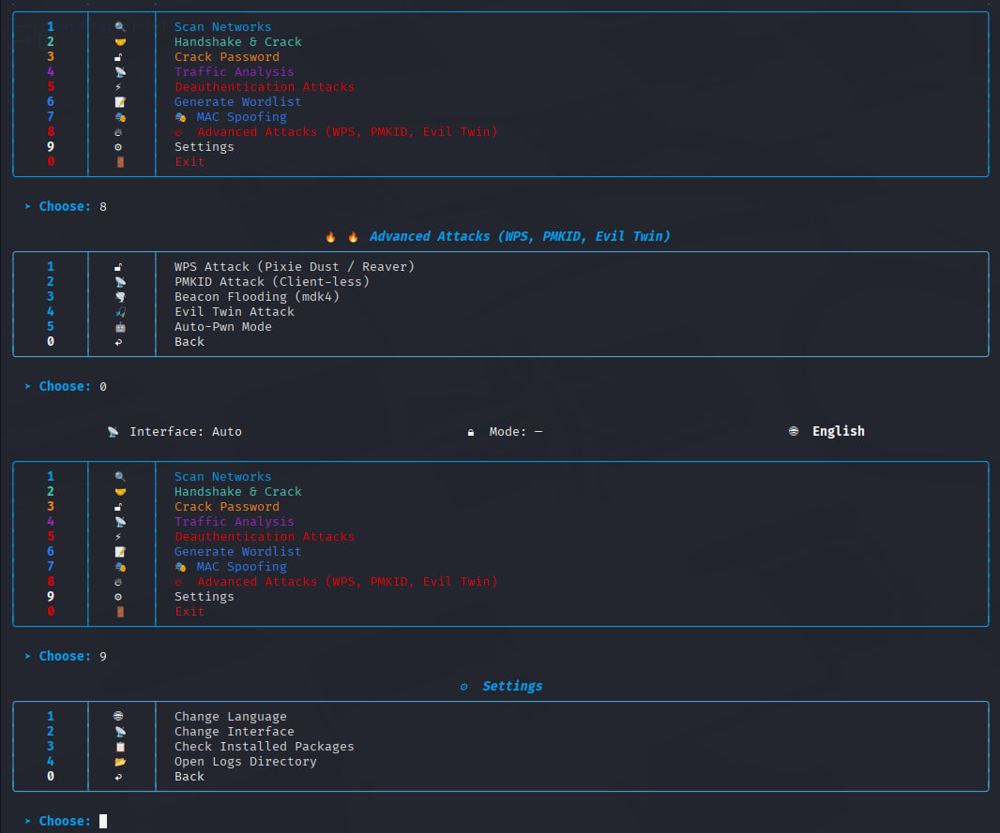

<div align="center">


# WiFiSlayerTool Framework v3.0


An advanced, highly modular framework designed for ethical hackers, penetration testers, and security researchers to audit and exploit 802.11 wireless networks. This tool streamlines complex attack vectors into a comprehensive, automated, and interactive terminal interface.
</div>


# 💀 WiFiSlayer v3.0 - Ultimate Wireless Penetration Testing Framework

**WiFiSlayer** is an advanced, automated, and highly interactive Wi-Fi penetration testing tool designed for ethical hackers, cybersecurity researchers, and pentesters. It streamlines complex wireless attacks into a sleek, professional terminal UI (available in both English and Arabic).

##  Core Features (Why WiFiSlayer?)
*   **WPA/WPA2 Cracking:** Automated Handshake and PMKID capture.
*   **Evil Twin Attacks:** Seamlessly deploy rogue access points.
*   **Deauthentication & Flooding:** Disrupt target networks using MDK4 and Aireplay-ng.
*   **Network Sniffing:** Monitor traffic and detect vulnerabilities in real-time.
*   **MAC Spoofing:** Stay completely anonymous during security audits.
*   **Rich UI:** Breathtaking, interactive terminal interface with responsive animations.

> **Disclaimer:** WiFiSlayer is developed for educational purposes and authorized security auditing only. The developer assumes no liability for illegal usage.

## Overview

The WiFiSlayerTool Framework automates the process of wireless auditing by combining industry-standard tools (aircrack-ng, reaver, mdk4, hcxdumptool, hostapd, dnsmasq) into a centralized execution environment. It features dual-language support, automated hardware detection, dynamic MAC spoofing, and advanced client-less attack vectors.

## 📸 Screenshots

<div align="center">
  
  
  
   
  
  
</div>

## Core Capabilities

*   **Auto-Pwn Mode:** A fully autonomous exploitation sequence that scans the environment, selects the optimal target based on signal strength and encryption, forces deauthentication, captures the WPA/WPA2 handshake, validates the capture, and initiates an immediate dictionary attack.
*   **Evil Twin Attack:** Deploys a rogue access point (AP) cloning the target's SSID, establishes a rogue DHCP/DNS server, and forces victims into a captive portal designed to harvest plaintext credentials.
*   **Client-less PMKID Attack:** Utilizes hcxdumptool to extract the PMKID hash directly from the router without requiring connected clients, followed by automated conversion to Hashcat format (hc22000).
*   **WPS Exploitation:** Integrates Pixie Dust and classic Reaver brute-force methodologies to exploit WPS registrar vulnerabilities and recover WPA passphrases in minutes.
*   **Beacon Flooding:** Leverages mdk4 to broadcast thousands of fictitious SSIDs, effectively degrading the operational integrity of nearby wireless infrastructure.
*   **Traffic Sniffing:** Passive interception and analysis of network packets.
*   **MAC Spoofing:** Dynamic interface anonymization via macchanger to prevent forensic tracking during engagements.
*   **Handshake Validation:** Automated verification of captured .cap files to ensure the presence of a valid 4-way WPA handshake prior to cracking.

## Prerequisites

This framework is built for Kali Linux or Debian-based security distributions. A wireless network adapter capable of **Monitor Mode** and **Packet Injection** is strictly required.

The following packages are utilized by the framework:
*   aircrack-ng suite
*   bettercap
*   macchanger
*   reaver & pixiewps
*   hcxdumptool & hcxtools
*   mdk4
*   hostapd & dnsmasq
*   python3 & pip3

## Installation

Clone the repository and execute the installation script to resolve all system and Python dependencies automatically.

```bash
git clone https://github.com/waheeb71/WiFi-Hacking-Tool.git
cd WiFi-Hacking-Tool
sudo bash install.sh
```

## Usage

The framework must be executed with root privileges to interact with network interfaces and modify kernel-level network configurations.

```bash
sudo python3 main.py
```

### Navigating the Framework

Upon execution, the framework presents a central command interface.
1.  **Scan Networks:** Enumerate nearby 802.11 Access Points and connected clients.
2.  **Handshake & Crack:** Capture WPA handshakes via targeted deauthentication and initiate offline dictionary or GPU-accelerated Hashcat attacks.
3.  **MAC Spoofing:** Randomize or define a custom MAC address for operational security.
4.  **Advanced Attacks:** Access the sub-menu for Evil Twin, PMKID, WPS, Beacon Flooding, and the Auto-Pwn sequence.

### Logging and Artifacts

All operational logs and captured artifacts are securely stored within the framework's directory:
*   `/logs/`: Contains detailed session execution logs and plaintext credentials captured via the Evil Twin captive portal.
*   `/caps/`: Stores intercepted PCAP/CAP files, captured PMKID hashes, and converted Hashcat files.

## Legal Disclaimer

This framework is developed strictly for educational purposes, academic research, and authorized security auditing. Any utilization of this software against networks or infrastructure without prior, explicit, and mutual consent is strictly prohibited and illegal.

The developer (Waheeb Al-Humaeri) assumes no liability and is not responsible for any misuse, damage, or legal consequences caused by this software.

## Author

**Developer:** Waheeb Al-Humaeri
**GitHub:** https://github.com/waheeb71
**Telegram:** @run_kernel
